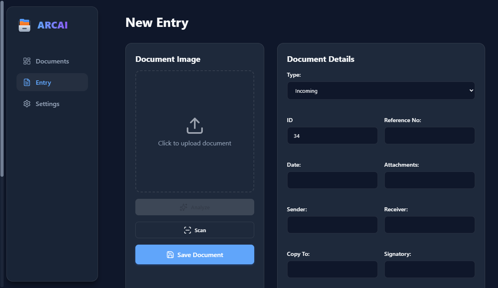
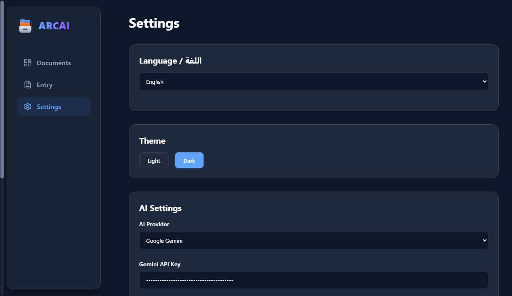

# ARCAI - Intelligent Archives

ARCAI is an intelligent document management system designed to streamline archiving and retrieval processes. By leveraging advanced AI models (such as Google Gemini and OpenAI), ARCAI analyzes, categorizes, and extracts critical information from documents, organizing them into an easily searchable database.

## 🚀 Features

### Intelligent Dashboard
View, manage, and organzie all your stored documents in one central hub. The dashboard provides quick access to your archives with powerful filtering options.


### AI-Powered Entry
Upload documents and let the AI do the heavy lifting. ARCAI automatically analyzes content to fill in details, tags, and summaries, reducing manual data entry.


### Comprehensive Settings
Customize your experience by configuring AI providers (Gemini, OpenAI, LLM7), adjusting themes, and managing application preferences.


### Key Capabilities
- **Smart Search**: Find documents instantly with advanced search capabilities, including Arabic text normalization.
- **Local-First Architecture**: Your data is stored locally using Dexie.js (IndexedDB) for maximum privacy and speed.
- **Multi-Provider AI**: seamless integration with multiple AI providers to suit your needs.
- **Responsive Design**: optimized for both desktop and mobile viewing.

## 🛠️ Tech Stack

- **Framework**: [React 19](https://react.dev/)
- **Build Tool**: [Vite](https://vitejs.dev/)
- **Runtime**: [Electron](https://www.electronjs.org/) (for Desktop)
- **Language**: [TypeScript](https://www.typescriptlang.org/)
- **Database**: [Dexie.js](https://dexie.org/) (IndexedDB wrapper)
- **AI Integration**:
  - Google Generative AI SDK
  - OpenAI SDK
- **Styling**: Modern CSS with responsive design principles

## 📦 Installation

1. **Clone the repository**
   ```bash
   git clone <repository-url>
   cd ARCAI
   ```

2. **Install dependencies**
   ```bash
   npm install
   ```

3. **Run Development Server** (Web)
   ```bash
   npm run dev
   ```

4. **Run Desktop App** (Electron)
   ```bash
   npm run electron
   ```

## 📱 Compatibility

- **Desktop**: Fully supported via Electron (Windows/macOS/Linux).
- **Mobile**: The application is designed to be responsive and mobile-friendly.
