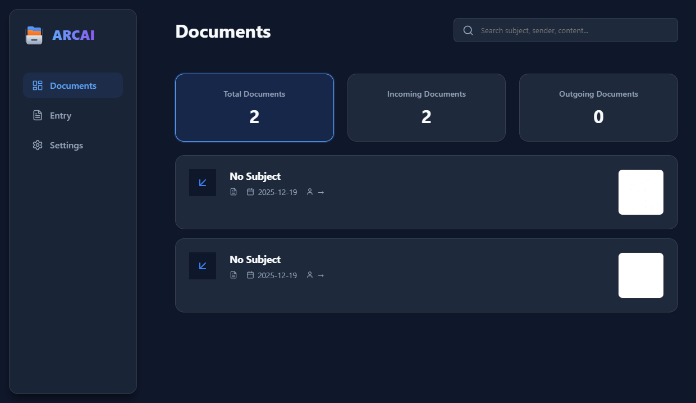

# ARCAI - Intelligent Archives



> **Modern. Intelligent. Secure.**
> ARCAI is a simple, local-first document management system designed to streamline archiving through advanced AI analysis and a beautiful, dynamic interface.


## 🚀 Overview

ARCAI (Archives with AI) solves the problem of manual document entry. By integrating state-of-the-art AI models (Google Gemini, OpenAI, LLM7), it automatically extracts critical metadata from your scanned documents—dates, subjects, senders, and more—translating and formatting them into a structured, searchable database.

Built with a **local-first** architecture, ARCAI ensures your sensitive data remains on your device while still offering the power of cloud-based AI analysis when needed.

## ✨ Key Features

### 🧠 Advanced AI Analysis
- **Auto-Extraction**: Upload a document image, and ARCAI automatically extracts:
  - Document Date & Reference Numbers
  - Sender & Receiver details
  - Subject & Content Summaries
  - Structured Data Tables
- **Multi-Provider Support**: Choose your preferred AI engine:
  - **Google Gemini**: Fast, cost-effective multimodal analysis.
  - **OpenAI (GPT-4o)**: High-precision text and vision capabilities.
  - **LLM7.io**: Specialized compatible models.
- **Arabic Normalization**: Smart searching capabilities that handle Arabic text variations (e.g., Alif/Hamza normalization) for accurate retrieval.

### 🎨 Dynamic & Responsive UX
- **Adaptive Design**: The interface is fully responsive, dynamically redesigning itself to fit any screen size—from large desktop monitors to mobile phone screens.
- **Fluid Animations**: Smooth transitions and micro-interactions powered by modern CSS and React 19.
- **Thumbnail View**: Rich visual previews of your document archives.

### 🏠 Local-First & Secure
- **IndexedDB Storage**: All your document data and images are stored locally in your browser/app via `Dexie.js`.
- **Privacy Focused**: No external servers hold your data. You own your archives.

### 📱 Cross-Platform
- **Desktop**: Native-like experience on Windows via Electron.
- **Mobile**: Fully optimized Android application via Capacitor.

## 📸 Visual Tour

### Intelligent Dashboard
*Centralized hub for managing archives with powerful filtering and search.*


### AI-Powered Entry
*Simple interface for document analysis or manual entry.*


### Comprehensive Settings
*Configure AI providers, themes, and application preferences.*


## 🛠️ Tech Stack

- **Frontend**: [React 19](https://react.dev/), [TypeScript](https://www.typescriptlang.org/), [Vite](https://vitejs.dev/)
- **Desktop Runtime**: [Electron](https://www.electronjs.org/)
- **Mobile Runtime**: [Capacitor](https://capacitorjs.com/)
- **Database**: [Dexie.js](https://dexie.org/) (IndexedDB)
- **Styling**: Vanilla CSS + Tailwind-inspired utility tokens for maximum performance.

## 📦 Installation & Setup

### Prerequisites
- Node.js (v18+)
- npm or yarn

### 1. Clone the Repository
```bash
git clone https://github.com/yourusername/ARCAI.git
cd ARCAI
```

### 2. Install Dependencies
```bash
npm install
```

### 3. Run Development Server (Web)
```bash
npm run dev
```

### 4. Build & Run Desktop App (Electron)
```bash
npm run electron
```

### 5. Build for Android
```bash
npm run build
npx cap sync
npx cap open android
```

## 🤖 AI Configuration
To unlock the full potential of ARCAI, you need to configure an AI provider in the **Settings** page:

1. Go to **Settings**.
2. Select your provider (**Gemini**, **OpenAI**, or **LLM7**).
3. Enter your API Key.
4. (Optional) Select a specific model (e.g., `gemini-1.5-flash`, `gpt-4o`).

*Note: Your API keys are stored locally in your browser's secure storage.*